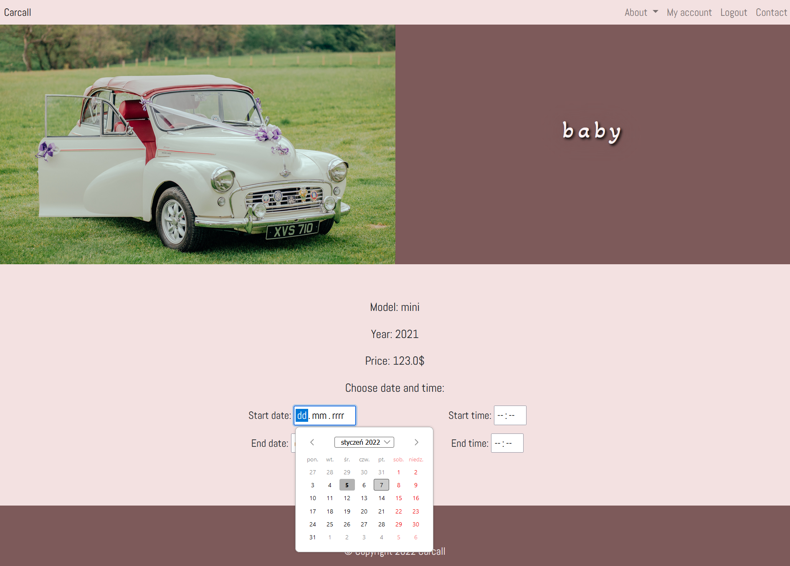

#  Carcall - A Simple Flask Wedding Cars for Hire Web App


## Table of contents
* [General info](#general-info)
* [Frontend](#frontend)
  * [Demo](#demo)
    * [Anonymous user operations](#anonymous-user-operations)
    * [Registered user operations](#registered-user-operations)
    * [Moderator operations](#moderator-operations)
    * [Admin operations](#admin-operations)
* [Backend](#backend)
  * [REST API](#rest-api)
      * [Cars](#cars)
      * [Users](#users)
      * [Authentication](#authentication)
      * [Comments](#comments)
      * [Opinions](#opinions)
      * [Rentals](#rentals)
      * [News Post](#news-post)
* [Setup](#setup)
* [Usage](#usage)
* [Technologies](#technologies)

## General info
This project provides a simple Web App for a fake wedding car rental company - Carcall.
It was created using Flask, SQLAlchemy, Python, REST API, Bootstrap, CSS, JS. App tests were written using the unittest module.

There are four user types on the platform with different permissions:

- anonymous user
- registered user 
- moderator 
- admin

The operations allowed depending on user permissions:

|                       | Anonymous User    | Registered User   | Moderator | Admin |
| --------------------- | :---------------: | :---------------: | :-------: |:----: |
| **Register**          | ✔️                |❌                | ❌        | ❌   |
| **Log in**            | ❌                 |✔️               |✔️         | ✔️  |
| **Add post**          | ❌                 | ❌              | ✔️        | ✔️  |
| **Comment post**      | ❌                 | ✔️              | ✔️        | ✔️  |
| **Add car**           | ❌                 | ❌              | ✔️        | ✔️  |
| **Edit car**          | ❌                 | ❌              | ✔️        | ✔️  |
| **Rent car**          | ❌                 | ✔️              | ✔️        | ✔️  |
| **Add opinion**       | ❌                 | ✔️              | ✔️        | ✔️  |
| **Change data**       | ❌                 | ✔️              | ✔️        | ✔️  |
| **Change users data** | ❌                 | ❌              | ❌        | ✔️  |
| **Delete car rental** | ❌                 | ❌              | ❌        | ✔️  |
| **Send message**      | ✔️                 | ✔️              | ✔️        | ✔️  |

The mentioned operations can also be performed by a dedicated REST API.

## Frontend

The client app is programmed using: Python, HTML, CSS, Bootstrap, JS, JQuery. 

### Demo

#### Anonymous user operations
*Register*

https://user-images.githubusercontent.com/78367584/148918394-d4f50366-f99d-4c05-83fb-9846ec44b66b.mp4

#### Registered user operations

*Rent a car*



https://user-images.githubusercontent.com/78367584/148919193-73be68eb-75ea-4f0c-8517-82b812240c7a.mp4

*Add a comment to the post*

https://user-images.githubusercontent.com/78367584/148921700-996124f5-9b11-424f-b767-1d99e74c2aa1.mp4

*Add an opinion*

https://user-images.githubusercontent.com/78367584/148919620-d03e7953-e070-46c0-abe1-e94ee35abd59.mp4

*Change data*

https://user-images.githubusercontent.com/78367584/148920094-6f220708-6571-4790-afb2-89035b2d1d7d.mp4

*Send a message*

https://user-images.githubusercontent.com/78367584/148919784-fc754193-80a7-458f-a6c1-fa7a648d6985.mp4

#### Moderator operations

*Add a car*

https://user-images.githubusercontent.com/78367584/148919557-e9726d72-7ad8-43bb-828f-58859e5ed70c.mp4

*Edit the car*

https://user-images.githubusercontent.com/78367584/148920539-1b9f9301-9ed8-456a-8251-64e01215464a.mp4

*Add a post*

https://user-images.githubusercontent.com/78367584/148919717-729a9a70-afde-407f-b862-dcda1cca89fe.mp4

#### Admin operations

*Change users data*

https://user-images.githubusercontent.com/78367584/148919937-deb80bd7-e773-43f3-8b79-78218afd24c7.mp4

*Delete car rental*

https://user-images.githubusercontent.com/78367584/148919849-62d814a8-9d23-49b0-b697-3cb820e0eda6.mp4

## Backend
Based on Flask (Python).

### REST API

Routing of the application:


#### <details><summary>Cars</summary><br>

 &emsp; **/api/v1/cars/** &emsp;&emsp;&emsp;&emsp;&emsp;&emsp;&emsp; 
 **Get all cars**
 
&emsp;&emsp;&emsp;*Parameters:*&emsp;&emsp;&emsp;&emsp;id, name, price, year, model, image, rentals_number<br>
&emsp;&emsp;&emsp;*Extra Parameters:* &emsp; rentals_url
 
&emsp;&emsp;&emsp;<ins>Headers:</ins><br>
&emsp;&emsp;&emsp;&emsp;&emsp;Accept: &emsp;application/json

&emsp;&emsp;&emsp;<ins>Possible Query Params:</ins><br>
&emsp;&emsp;&emsp;&emsp;&emsp;sort &emsp;&emsp;&emsp;&emsp;&emsp;&emsp; sort by parameters<br>
&emsp;&emsp;&emsp;&emsp;&emsp;parameter &emsp;&emsp; &emsp; is equal (for rentals_number works only without paging)<br>
&emsp;&emsp;&emsp;&emsp;&emsp;parameter[filter]&emsp;filters: [gt],[gte],[lt],[lte],[like] (for rentals_number works only without paging)<br>
&emsp;&emsp;&emsp;&emsp;&emsp;params &emsp;&emsp;&emsp; &emsp; parameters to be removed (parameters and extra parameters)<br>
&emsp;&emsp;&emsp;&emsp;&emsp;page &emsp;&emsp;&emsp;&emsp; &emsp; page number for paging<br>
&emsp;&emsp;&emsp;&emsp;&emsp;per_page&emsp;&emsp;&emsp;&emsp;number of records on one page for paging (required for paging)<br>


Example Request:
```shell
curl --location -g --request GET 'http://127.0.0.1:5000//api/v1/cars/?params=image,name,rentals_url,price&id[lte]=17&sort=-year,-id&rentals_number=2&id[lt]=5' \
--header 'Accept: application/json'
```
Example Response:
```
{
    "data": [
        {
            "id": 3,
            "model": "everything",
            "rentals_number": 2,
            "year": 1999
        },
        {
            "id": 2,
            "model": "administration",
            "rentals_number": 2,
            "year": 1983
        }
    ],
    "number_of_records": 2,
    "success": true
```
 --------------------------------------------------------------------------------------------------------------------------------
 &emsp; **/api/v1/cars/{{car_id}}/** &emsp;&emsp;&emsp;**Get single car**
 
&emsp;&emsp;&emsp;*Parameters:*&emsp;&emsp;&emsp;&emsp;id, name, price, year, model, image, rentals_number<br>
&emsp;&emsp;&emsp;*Extra Parameters:* &emsp; rentals_url
 
&emsp;&emsp;&emsp;<ins>Headers:</ins><br>
&emsp;&emsp;&emsp;&emsp;&emsp;Accept: &emsp;application/json
 
&emsp;&emsp;&emsp;<ins>Possible Query Params:</ins><br>
&emsp;&emsp;&emsp;&emsp;&emsp;params&emsp; parameters to be removed (parameters and extra parameters)<br>

Example Request:
```shell
curl --location --request GET 'http://127.0.0.1:5000//api/v1/cars/1?params=image,rentals_url' \
--header 'Accept: application/json'
```
Example Response:
```
{
    "data": {
        "id": 1,
        "model": "mini",
        "name": "baby",
        "price": 123.0,
        "rentals_number": 4,
        "year": 2021
    },
    "success": true
}
```
 --------------------------------------------------------------------------------------------------------------------------------
 &emsp; **/api/v1/cars/**&emsp;&emsp;&emsp;&emsp;&emsp;&emsp;&emsp; **Add car**

&emsp;&emsp;&emsp;<ins>Headers:</ins><br>
&emsp;&emsp;&emsp;&emsp;&emsp;Accept: &emsp;&emsp;&emsp;&emsp;application/json<br>
&emsp;&emsp;&emsp;&emsp;&emsp;Content-Type: &emsp;application/json<br>
&emsp;&emsp;&emsp;&emsp;&emsp;Authorization: &emsp;Bearer {token}
 
Example Request:
```shell
curl --location --request POST 'http://127.0.0.1:5000//api/v1/cars/' \
--header 'Content-Type: application/json' \
--header 'Authorization: Bearer {token}' \
--data-raw '{
    "name":"Car name",
    "price":20,
    "year":2021,
    "model":"Car model"
}'
```
Example Response:
```
{
    "data": {
        "id": 27,
        "image": "/static/img/no_img.jpg",
        "model": "Car model",
        "name": "Car name",
        "price": 20.0,
        "rentals_number": 0,
        "rentals_url": [],
        "year": 2021
    },
    "success": true
}
```
 --------------------------------------------------------------------------------------------------------------------------------
 &emsp; **/api/v1/cars/{{car_id}}/** &emsp;&emsp;&emsp; **Update car**

&emsp;&emsp;&emsp;<ins>Headers:</ins><br>
&emsp;&emsp;&emsp;&emsp;&emsp;Accept: &emsp;&emsp;&emsp;&emsp;application/json<br>
&emsp;&emsp;&emsp;&emsp;&emsp;Content-Type: &emsp;application/json<br>
&emsp;&emsp;&emsp;&emsp;&emsp;Authorization: &emsp;Bearer {token}
 
Example Request:
```shell
curl --location --request PUT 'http://127.0.0.1:5000//api/v1/cars/' \
--header 'Authorization: Bearer {token}' \
--header 'Content-Type: application/json' \
--data-raw '{
    "car_to_edit_id":27,
    "name":"New name",
    "price":12,
    "year":2000,
    "model":"New model"
}'
```
Example Response:
```
{
    "data": {
        "id": 27,
        "image": "/static/img/no_img.jpg",
        "model": "New model",
        "name": "New name",
        "price": 12.0,
        "rentals_number": 0,
        "rentals_url": [],
        "year": 2000
    },
    "success": true
}
```
</details>


#### <details><summary>Users</summary><br>

 &emsp; **/api/v1/users/**&emsp;&emsp;&emsp;&emsp;&emsp;&emsp;&emsp;
**Get all users**
 
&emsp;&emsp;&emsp;*Parameters:*&emsp;&emsp;&emsp;&emsp;id, name, surname, email, telephone, address, role_id, rentals_number, post_number, opinions_number, <br>&emsp;&emsp;&emsp;&emsp;&emsp;&emsp;&emsp;&emsp;&emsp;&emsp;&emsp;&emsp;comments_number<br>
&emsp;&emsp;&emsp;*Extra Parameters:* &emsp; rentals, posts, opinions, comments
 
&emsp;&emsp;&emsp;<ins>Headers:</ins><br>
&emsp;&emsp;&emsp;&emsp;&emsp;Accept: &emsp; &emsp; &emsp; application/json<br>
&emsp;&emsp;&emsp;&emsp;&emsp;Authorization:&emsp;Bearer {token}

&emsp;&emsp;&emsp;<ins>Possible Query Params:</ins><br>
&emsp;&emsp;&emsp;&emsp;&emsp;sort &emsp;&emsp;&emsp;&emsp;&emsp;&emsp; sort by parameters<br>
&emsp;&emsp;&emsp;&emsp;&emsp;parameter &emsp;&emsp; &emsp; is equal (for parameters with _number works only without paging)<br>
&emsp;&emsp;&emsp;&emsp;&emsp;parameter[filter]&emsp;filters: [gt],[gte],[lt],[lte],[like] (for parameters with _number works only without paging)<br>
&emsp;&emsp;&emsp;&emsp;&emsp;params &emsp;&emsp; &emsp; &emsp; parameters to be removed (parameters and extra parameters)<br>
&emsp;&emsp;&emsp;&emsp;&emsp;page &emsp;&emsp;&emsp; &emsp; &emsp; page number for paging<br>
&emsp;&emsp;&emsp;&emsp;&emsp;per_page&emsp;&emsp;&emsp; &emsp;number of records on one page for paging (required for paging)<br>


Example Request:
```shell
curl --location -g --request GET 'http://127.0.0.1:5000//api/v1/users/?params=comments,posts,rentals,opinions&rentals_number[gte]=4&role_id=1' \
--header 'Accept: application/json' \
--header 'Authorization: Bearer {token}'
```
Example Response:
```
{
    "data": [
        {
            "address": "ul kwiatowa 11",
            "comments_number": 10,
            "email": "cookjose@hoover.com",
            "id": 7,
            "name": "Jose",
            "opinions_number": 1,
            "post_number": 2,
            "rentals_number": 4,
            "role_id": 1,
            "surname": "Cook",
            "telephone": 444444444
        }
    ],
    "number_of_records": 1,
    "success": true
}
```
 --------------------------------------------------------------------------------------------------------------------------------
 &emsp; **/api/v1/users/{{user_id}}/** &emsp;&emsp; **Get single user**
 
&emsp;&emsp;&emsp;*Parameters:*&emsp;&emsp;&emsp;&emsp;id, name, surname, email, telephone, address, role_id, rentals_number, post_number, opinions_number, <br>&emsp;&emsp;&emsp;&emsp;&emsp;&emsp;&emsp;&emsp;&emsp;&emsp;&emsp;&emsp;comments_number<br>
&emsp;&emsp;&emsp;*Extra Parameters:* &emsp; rentals, posts, opinions, comments
 
&emsp;&emsp;&emsp;<ins>Headers:</ins><br>
&emsp;&emsp;&emsp;&emsp;&emsp;Accept: &emsp;&emsp; &emsp; application/json<br>
&emsp;&emsp;&emsp;&emsp;&emsp;Authorization:&emsp;Bearer {token}
 
&emsp;&emsp;&emsp;<ins>Possible Query Params:</ins><br>
&emsp;&emsp;&emsp;&emsp;&emsp;params &emsp;&emsp; &emsp; &emsp; parameters to be removed (parameters and extra parameters)<br>

 
Example Request:
```shell
curl --location --request GET 'http://127.0.0.1:5000//api/v1/users/7/?params=posts,address,comments,rentals' \
--header 'Authorization: Bearer {token}' \
--header 'Accept: application/json'
```
Example Response:
```
{
    "data": {
        "comments_number": 10,
        "email": "cookjose@hoover.com",
        "id": 7,
        "name": "Jose",
        "opinions": [
            "/api/v1/opinions/12/"
        ],
        "opinions_number": 1,
        "post_number": 2,
        "rentals_number": 4,
        "role_id": 1,
        "surname": "Cook",
        "telephone": 444444444
    },
    "success": true
}
```
</details>


#### <details><summary>Authentication</summary><br>

 &emsp; **/api/v1/auth/about_me/** &emsp;&emsp;&emsp; **Get user data**

&emsp;&emsp;&emsp;<ins>Headers:</ins><br>
&emsp;&emsp;&emsp;&emsp;&emsp;Authorization: &emsp; Bearer {token}

Example Request:
```shell
curl --location --request GET 'http://127.0.0.1:5000//api/v1/auth/about_me/' \
--header 'Authorization: Bearer {token}'
```
Example Response:
```
{
    "data": {
        "address": ul kwiatowa 11,
        "email": "cookjose@hoover.com",
        "name": "Cook",
        "surname": "Jose",
        "telephone": 444444444
    },
    "success": true
}
```
  --------------------------------------------------------------------------------------------------------------------------------
 &emsp; **/api/v1/auth/register/** &emsp;&emsp;&emsp;&emsp;**Register**

&emsp;&emsp;&emsp;<ins>Headers:</ins><br>
&emsp;&emsp;&emsp;&emsp;&emsp;Accept: &emsp;&emsp;&emsp;&emsp;application/json<br>
&emsp;&emsp;&emsp;&emsp;&emsp;Content-Type: &emsp;application/json<br>

 Example Request:
```shell
curl --location --request POST 'http://127.0.0.1:5000//api/v1/auth/register/' \
--header 'Accept: application/json' \
--header 'Content-Type: application/json' \
--data-raw '{
    "name":"Your_name",
    "surname":"Your_surname",
    "email":"your_email@example.com",
    "password":"your_password",
    "telephone":"your_telephone"
}'
```
Example Response:
```
{
    "success": true,
    "token": "token_value"
}
```
  --------------------------------------------------------------------------------------------------------------------------------
 &emsp; **/api/v1/auth/login/** &emsp;&emsp;&emsp;&emsp;&emsp; **Log in**

&emsp;&emsp;&emsp;<ins>Headers:</ins><br>
&emsp;&emsp;&emsp;&emsp;&emsp;Accept: &emsp;&emsp;&emsp;&emsp;application/json<br>
&emsp;&emsp;&emsp;&emsp;&emsp;Content-Type: &emsp;application/json<br>

Example Request:
```shell
curl --location --request POST 'http://127.0.0.1:5000//api/v1/auth/login/' \
--header 'Accept: application/json' \
--header 'Content-Type: application/json' \
--data-raw '{
    "email":"your_email@example.com",
    "password":"your_password"
}'
```
Example Response:
```
{
    "success": true,
    "token": "token_value"
}
```
  --------------------------------------------------------------------------------------------------------------------------------
 &emsp; **/api/v1/auth/user/** &emsp;&emsp;&emsp;&emsp;&emsp;&emsp;**Update user**

&emsp;&emsp;&emsp;<ins>Headers:</ins><br>
&emsp;&emsp;&emsp;&emsp;&emsp;Accept: &emsp;&emsp;&emsp;&emsp;application/json<br>
&emsp;&emsp;&emsp;&emsp;&emsp;Content-Type: &emsp;application/json<br>
&emsp;&emsp;&emsp;&emsp;&emsp;Authorization: &emsp; Bearer {token}

Example Request:
```shell
curl --location --request PUT 'http://127.0.0.1:5000//api/v1/auth/user/' \
--header 'Authorization: Bearer {token}' \
--header 'Content-Type: application/json' \
--header 'Accept: application/json' \
--data-raw '{
    "name": "new_name",
    "surname": "new_surname",
    "address": "new_address",
    "telephone": "new_telephone",
    "email":"your_new_email@example.com",
    "password":"your_password",
    "new_password":"your_new_password"
}'
```
Example Response:
```
{
    "data": {
        "address": "new_address",
        "email": "your_new_email@example.com",
        "name": "new_name",
        "surname": "new_surname",
        "telephone": "new_telephone"
    },
    "success": true
}
```
  --------------------------------------------------------------------------------------------------------------------------------
 &emsp; **/api/v1/cars/{{car_id}}** &emsp;&emsp;&emsp;&emsp; **Update user by admin**

&emsp;&emsp;&emsp;<ins>Headers:</ins><br>
&emsp;&emsp;&emsp;&emsp;&emsp;Accept: &emsp;&emsp;&emsp;&emsp;application/json<br>
&emsp;&emsp;&emsp;&emsp;&emsp;Content-Type: &emsp;application/json<br>
&emsp;&emsp;&emsp;&emsp;&emsp;Authorization: &emsp; Bearer {token}

Example Request:
```shell
curl --location --request PUT 'http://127.0.0.1:5000//api/v1/auth/admin/' \
--header 'Accept: application/json' \
--header 'Content-Type: application/json' \
--header 'Authorization: Bearer {token}' \
--data-raw '{
    "user_to_edit_id":14,
    "role_id":2,
    "address": null,
    "email": "new@test.com",
    "name": "name",
    "surname": "surname",
    "telephone": 12345
}'
```
Example Response:
```
{
    "data": {
        "address": null,
        "email": "new@test.com",
        "name": "name",
        "surname": "surname",
        "telephone": 12345
    },
    "role": "Moderator",
    "success": true
}
```
  --------------------------------------------------------------------------------------------------------------------------------
 &emsp; **/api/v1/cars/{{car_id}}** &emsp;&emsp;&emsp; **Update password, email**

&emsp;&emsp;&emsp;<ins>Headers:</ins><br>
&emsp;&emsp;&emsp;&emsp;&emsp;Accept: &emsp;&emsp;&emsp;&emsp;application/json<br>
&emsp;&emsp;&emsp;&emsp;&emsp;Content-Type: &emsp;application/json<br>
&emsp;&emsp;&emsp;&emsp;&emsp;Authorization: &emsp; Bearer {token}
 
Example Request:
```shell
curl --location --request PATCH 'http://127.0.0.1:5000//api/v1/auth/user/' \
--header 'Authorization: Bearer {token}' \
--header 'Content-Type: application/json' \
--header 'Accept: application/json' \
--data-raw '{
    "password":"password",
    "new_password":"new_password",
    "new_email":"your_new_email@example.com"

}'
```
Example Response:
```
{
    "success": true
}
```
</details>

#### <details><summary>Comments</summary><br>

 &emsp; **/api/v1/comments/** &emsp;&emsp;&emsp;&emsp;&emsp;&emsp;&emsp;&emsp;&emsp; **Get all comments**

&emsp;&emsp;&emsp;*Parameters:*&emsp;&emsp;&emsp;&emsp;id, post_url, author_url, text, date, upper_comment_url<br>
 
&emsp;&emsp;&emsp;<ins>Headers:</ins><br>
&emsp;&emsp;&emsp;&emsp;&emsp;Accept: &emsp;&emsp;&emsp;&emsp;application/json<br>
 
&emsp;&emsp;&emsp;<ins>Possible Query Params:</ins><br>
&emsp;&emsp;&emsp;&emsp;&emsp;sort &emsp;&emsp;&emsp;&emsp;&emsp;&emsp; sort by parameters<br>
&emsp;&emsp;&emsp;&emsp;&emsp;parameter &emsp;&emsp; &emsp; is equal <br>
&emsp;&emsp;&emsp;&emsp;&emsp;parameter[filter]&emsp;filters: [gt],[gte],[lt],[lte],[like] <br>
&emsp;&emsp;&emsp;&emsp;&emsp;params &emsp;&emsp; &emsp; &emsp; parameters to be removed<br>
&emsp;&emsp;&emsp;&emsp;&emsp;page &emsp;&emsp;&emsp; &emsp; &emsp; page number for paging<br>
&emsp;&emsp;&emsp;&emsp;&emsp;per_page&emsp;&emsp;&emsp; &emsp;number of records on one page for paging (required for paging)<br>
 
Example Request:
```shell
curl --location -g --request GET 'http://127.0.0.1:5000//api/v1/comments/?params=author_url&sort=-id&id[lte]=12&per_page=2&id[gt]=2' \
--header 'Accept: application/json'
```

Example Response:
```
{
    "data": [
        {
            "date": "15/08/1975, 09:54:32",
            "id": 12,
            "post_url": "/api/v1/posts/7/",
            "text": "Figure perform east day raise day. Fall argue message yeah court. Give visit others very.\nBuild least knowledge group today her range. Per military free summer early ever. Fund fill quickly fast.",
            "upper_comment_url": null
        },
        {
            "date": "15/03/1978, 08:44:34",
            "id": 11,
            "post_url": "/api/v1/posts/1/",
            "text": "Big sister list huge while beyond capital identify. Congress campaign garden somebody. Individual receive think second itself.\nLive stock officer mouth head major scene. Painting peace stage it just.",
            "upper_comment_url": null
        }
    ],
    "number_of_records": 2,
    "pagination": {
        "current_page_url": "/api/v1/comments/?page=1&params=author_url&sort=-id&id%5Blte%5D=12&per_page=2&id%5Bgt%5D=2",
        "next_page": "/api/v1/comments/?page=2&params=author_url&sort=-id&id%5Blte%5D=12&per_page=2&id%5Bgt%5D=2",
        "number_of_all_pages": 5,
        "number_of_all_records": 10
    },
    "success": true
}
```
--------------------------------------------------------------------------------------------------------------------------------
 
 &emsp; **/api/v1/comments/{{comment_id}}/** &emsp;&emsp;**Get single comment**

&emsp;&emsp;&emsp;*Parameters:*&emsp;&emsp;&emsp;&emsp;id, post_url, author_url, text, date, upper_comment_url<br>

&emsp;&emsp;&emsp;<ins>Headers:</ins><br>
&emsp;&emsp;&emsp;&emsp;&emsp;Accept: &emsp;&emsp;&emsp;&emsp;application/json<br>

&emsp;&emsp;&emsp;<ins>Possible Query Params:</ins><br>
&emsp;&emsp;&emsp;&emsp;&emsp;params &emsp;&emsp; &emsp; &emsp; parameters to be removed<br>
 
Example Request:
```shell
curl --location --request GET 'http://127.0.0.1:5000//api/v1/comments/1?params=upper_comment_url' \
--header 'Accept: application/json'
```
Example Response:
```
{
    "data": {
        "author_url": "/api/v1/users/11/",
        "date": "12/08/2020, 11:26:38",
        "id": 1,
        "post_url": "/api/v1/posts/14/",
        "text": "first one"
    },
    "success": true
}
```
--------------------------------------------------------------------------------------------------------------------------------
 &emsp; **/api/v1/comments/**&emsp;&emsp;&emsp;&emsp;&emsp;&emsp;&emsp;&emsp;&emsp; **Add comment**

&emsp;&emsp;&emsp;<ins>Headers:</ins><br>
&emsp;&emsp;&emsp;&emsp;&emsp;Accept: &emsp;&emsp;&emsp;&emsp;application/json<br>
&emsp;&emsp;&emsp;&emsp;&emsp;Content-Type: &emsp;application/json<br>
&emsp;&emsp;&emsp;&emsp;&emsp;Authorization: &emsp; Bearer {token}
 
Example Request:
```shell
curl --location --request POST 'http://127.0.0.1:5000//api/v1/comments/' \
--header 'Accept: application/json' \
--header 'Content-Type: application/json' \
--header 'Authorization: Bearer {token}' \
--data-raw '{
    "text":"New comment",
    "post_id":1,
    "upper_comment":11
}'
```
Example Response:
```
{
    "data": {
        "author_url": "/api/v1/users/12/",
        "date": "07/01/2022, 15:05:25",
        "id": 95,
        "post_url": "/api/v1/posts/1/",
        "text": "New comment",
        "upper_comment_url": "/api/v1/comments/11/"
    },
    "success": true
}
```
</details>

#### <details><summary>Opinions</summary><br>

 &emsp; **/api/v1/opinions/** &emsp;&emsp;&emsp;&emsp;&emsp;&emsp;&emsp;&emsp;&emsp;**Get all opinions**
 
&emsp;&emsp;&emsp;*Parameters:*&emsp;&emsp;&emsp;&emsp;id, text, date, image_url, author_url<br>
 
&emsp;&emsp;&emsp;<ins>Headers:</ins><br>
&emsp;&emsp;&emsp;&emsp;&emsp;Accept: &emsp;&emsp;&emsp;&emsp;application/json<br>

&emsp;&emsp;&emsp;<ins>Possible Query Params:</ins><br>
&emsp;&emsp;&emsp;&emsp;&emsp;sort &emsp;&emsp;&emsp;&emsp;&emsp;&emsp; sort by parameters<br>
&emsp;&emsp;&emsp;&emsp;&emsp;parameter &emsp;&emsp; &emsp; is equal<br>
&emsp;&emsp;&emsp;&emsp;&emsp;parameter[filter]&emsp;filters: [gt],[gte],[lt],[lte],[like] <br>
&emsp;&emsp;&emsp;&emsp;&emsp;params &emsp;&emsp; &emsp; &emsp; parameters to be removed<br>
&emsp;&emsp;&emsp;&emsp;&emsp;page &emsp;&emsp;&emsp; &emsp; &emsp; page number for paging<br>
&emsp;&emsp;&emsp;&emsp;&emsp;per_page&emsp;&emsp;&emsp; &emsp;number of records on one page for paging (required for paging)<br>
 
Example Request:
```shell
curl --location -g --request GET 'http://127.0.0.1:5000//api/v1/opinions/?sort=-date&id[lt]=13&params=author_url&date[gte]=2017-01-27_00:00:00' \
--header 'Accept: application/json'
```
Example Response:
```
{
    "data": [
        {
            "date": "25/08/2021, 21:12:08",
            "id": 12,
            "image_url": "/static/img/opinion1.jpg",
            "text": "My opinion"
        },
        {
            "date": "12/08/2021, 11:15:56",
            "id": 1,
            "image_url": "/static/img/opinion1.jpg",
            "text": "GREAT"
        },
        {
            "date": "31/10/2020, 00:00:00",
            "id": 2,
            "image_url": "/static/img/opinion1.jpg",
            "text": "Fly end reality."
        },
        {
            "date": "27/01/2017, 00:00:00",
            "id": 6,
            "image_url": "/static/img/opinion2.jpg",
            "text": "Everybody field in."
        }
    ],
    "number_of_records": 4,
    "success": true
}
```
  --------------------------------------------------------------------------------------------------------------------------------
 &emsp; **/api/v1/opinions/{{opinion_id}}/**&emsp;&emsp;&emsp; **Get single opinion**

&emsp;&emsp;&emsp;*Parameters:*&emsp;&emsp;&emsp;&emsp;id, date, author_url, text, image_url<br>
 
&emsp;&emsp;&emsp;<ins>Headers:</ins><br>
&emsp;&emsp;&emsp;&emsp;&emsp;Accept: &emsp;&emsp;&emsp;&emsp;application/json<br>

&emsp;&emsp;&emsp;<ins>Possible Query Params:</ins><br>
&emsp;&emsp;&emsp;&emsp;&emsp;params &emsp;&emsp; &emsp; &emsp; parameters to be removed<br>

Example Request:
```shell
curl --location --request GET 'http://127.0.0.1:5000//api/v1/opinions/3?params=author_url' \
--header 'Accept: application/json'
```
Example Response:
```
{
    "data": {
        "date": "15/05/1973, 00:00:00",
        "id": 3,
        "image_url": "/static/img/opinion2.jpg",
        "text": "Television article until region listen brother money."
    },
    "success": true
}
```
 --------------------------------------------------------------------------------------------------------------------------------
 &emsp; **/api/v1/opinions/**&emsp;&emsp;&emsp;&emsp;&emsp;&emsp;&emsp;&emsp;&emsp;**Add opinion**

&emsp;&emsp;&emsp;<ins>Headers:</ins><br>
&emsp;&emsp;&emsp;&emsp;&emsp;Accept: &emsp;&emsp;&emsp;&emsp;application/json<br>
&emsp;&emsp;&emsp;&emsp;&emsp;Content-Type: &emsp;application/json<br>
&emsp;&emsp;&emsp;&emsp;&emsp;Authorization: &emsp; Bearer {token}
 
Example Request:
```shell
curl --location --request POST 'http://127.0.0.1:5000//api/v1/opinions/' \
--header 'Accept: application/json' \
--header 'Authorization: Bearer {token}' \
--header 'Content-Type: application/json' \
--data-raw '{
    "text":"New opinion"
}'
```
Example Response:
```
{
    "data": {
        "author_url": "/api/v1/users/4/",
        "date": "03/01/2022, 17:33:48",
        "id": 15,
        "image_url": "/static/img/opinion3.jpg",
        "text": "New opinion"
    },
    "success": true
}
```
</details>

#### <details><summary>Rentals</summary><br>

 &emsp; **/api/v1/rentals/** &emsp;&emsp;&emsp;&emsp;&emsp;&emsp;&emsp;&emsp;&emsp;&emsp;&emsp;&emsp;&emsp; **Get all rentals**
 
&emsp;&emsp;&emsp;*Parameters:*&emsp;&emsp;&emsp;&emsp;id, from_date, available_from, to_date, car_url, user_url<br>
 
&emsp;&emsp;&emsp;<ins>Headers:</ins><br>
&emsp;&emsp;&emsp;&emsp;&emsp;Accept: &emsp;&emsp;&emsp;&emsp;application/json<br>
&emsp;&emsp;&emsp;&emsp;&emsp;Authorization: &emsp; Bearer {token}

&emsp;&emsp;&emsp;<ins>Possible Query Params:</ins><br>
&emsp;&emsp;&emsp;&emsp;&emsp;sort &emsp;&emsp;&emsp;&emsp;&emsp;&emsp; sort by parameters<br>
&emsp;&emsp;&emsp;&emsp;&emsp;parameter &emsp;&emsp; &emsp; is equal<br>
&emsp;&emsp;&emsp;&emsp;&emsp;parameter[filter]&emsp;filters: [gt],[gte],[lt],[lte],[like]<br>
 
Example Request:
```shell
curl --location -g --request GET 'http://127.0.0.1:5000//api/v1/rentals/?from_date[gt]=2016-03-18_13:40:00&to_date[lt]=2020-01-01_00:00:00' \
--header 'Accept: application/json' \
--header 'Authorization: Bearer {token}'
```
Example Response:
```
{
    "data": [
        {
            "available_from": "25/03/2016, 12:29:38",
            "car_url": "/api/v1/cars/3/",
            "from_date": "18/03/2016, 13:40:18",
            "id": {
                "car": 3,
                "from": "18/03/2016, 13:40",
                "user": 11
            },
            "to_date": "25/03/2016, 11:29:38",
            "user_url": "/api/v1/users/11/"
        }
    ],
    "success": true
}
```
 
  --------------------------------------------------------------------------------------------------------------------------------
 
 &emsp; **/api/v1/rentals/car{{car_id}}/user{{user_id}}/from{{%Y%m%d%H%M}}/**&emsp;**Get single rental**
 
&emsp;&emsp;&emsp;*Parameters:*&emsp;&emsp;&emsp;&emsp;id, from_date, available_from, to_date, car_url, user_url<br>
 
&emsp;&emsp;&emsp;<ins>Headers:</ins><br>
&emsp;&emsp;&emsp;&emsp;&emsp;Accept: &emsp;&emsp;&emsp;&emsp;application/json<br>
&emsp;&emsp;&emsp;&emsp;&emsp;Authorization: &emsp; Bearer {token}

&emsp;&emsp;&emsp;<ins>Possible Query Params:</ins><br>
&emsp;&emsp;&emsp;&emsp;&emsp;params &emsp;&emsp;&emsp; &emsp; parameters to be removed<br>
 
Example Request:
```shell
curl --location --request GET 'http://127.0.0.1:5000//api/v1/rentals/car2/user7/from202308122020/?params=id' \
--header 'Accept: application/json' \
--header 'Authorization: Bearer {token}'
```
Example Response:
```
{
    "data": {
        "available_from": "28/09/2023, 21:21:00",
        "car_url": "/api/v1/cars/2/",
        "from_date": "12/08/2023, 20:20:00",
        "to_date": "28/09/2023, 20:21:00",
        "user_url": "/api/v1/users/7/"
    },
    "success": true
}
```
 
 --------------------------------------------------------------------------------------------------------------------------------
 &emsp; **/api/v1/rentals/** &emsp;&emsp;&emsp;&emsp;&emsp;&emsp;&emsp;&emsp;&emsp;&emsp;&emsp;&emsp;&emsp; **Add rental**

&emsp;&emsp;&emsp;<ins>Headers:</ins><br>
&emsp;&emsp;&emsp;&emsp;&emsp;Accept: &emsp;&emsp;&emsp;&emsp;application/json<br>
&emsp;&emsp;&emsp;&emsp;&emsp;Content-Type: &emsp;application/json<br>
&emsp;&emsp;&emsp;&emsp;&emsp;Authorization: &emsp; Bearer {token}
 
Example Request:
```shell
curl --location --request POST 'http://127.0.0.1:5000//api/v1/rentals/' \
--header 'Accept: application/json' \
--header 'Content-Type: application/json' \
--header 'Authorization: Bearer {token}' \
--data-raw '{
    "user_id_rental" :2,
    "car_id":5,
    "from_date": 202308122020,
    "to_date": 202309282021
}'
```
Example Response:
```
{
    "data": {
        "available_from": "28/09/2023, 21:21:00",
        "car_url": "/api/v1/cars/5/",
        "from_date": "12/08/2023, 20:20:00",
        "id": {
            "car": 5,
            "from": "12/08/2023, 20:20",
            "user": 2
        },
        "to_date": "28/09/2023, 20:21:00",
        "user_url": "/api/v1/users/2/"
    },
    "success": true
}
```
 --------------------------------------------------------------------------------------------------------------------------------
 &emsp; **/api/v1/rentals/**&emsp;&emsp;&emsp;&emsp;&emsp;&emsp;&emsp;&emsp;&emsp;&emsp;&emsp;&emsp;&emsp;&emsp;**Delete rental**

&emsp;&emsp;&emsp;<ins>Headers:</ins><br>
&emsp;&emsp;&emsp;&emsp;&emsp;Accept: &emsp;&emsp;&emsp;&emsp;application/json<br>
&emsp;&emsp;&emsp;&emsp;&emsp;Authorization: &emsp; Bearer {token}

Example Request:
```shell
curl --location --request DELETE 'http://127.0.0.1:5000//api/v1/rentals/car5/user2/from202308122020/' \
--header 'Accept: application/json' \
--header 'Authorization: Bearer {token}'
```
Example Response:
```
{
    "success": true
}
```
 
</details>

#### <details><summary>News Post</summary><br>

 &emsp; **/api/v1/posts/** &emsp;&emsp;&emsp;&emsp;&emsp;&emsp;&emsp;&emsp;&emsp;**Get all news posts**
 
&emsp;&emsp;&emsp;*Parameters:*&emsp;&emsp;&emsp;&emsp;id, title, text, date, img_url, user_url, comments_urls<br>
&emsp;&emsp;&emsp;*Extra Parameters:* &emsp; comments_number
 
&emsp;&emsp;&emsp;<ins>Headers:</ins><br>
&emsp;&emsp;&emsp;&emsp;&emsp;Accept: &emsp;&emsp;&emsp;&emsp;application/json<br>
 
&emsp;&emsp;&emsp;<ins>Possible Query Params:</ins><br>
&emsp;&emsp;&emsp;&emsp;&emsp;sort &emsp;&emsp;&emsp;&emsp;&emsp;&emsp; sort by parameters<br>
&emsp;&emsp;&emsp;&emsp;&emsp;parameter &emsp;&emsp; &emsp; is equal (for rentals_number works only without paging)<br>
&emsp;&emsp;&emsp;&emsp;&emsp;parameter[filter]&emsp;filters: [gt],[gte],[lt],[lte],[like] (for rentals_number works only without paging)<br>
&emsp;&emsp;&emsp;&emsp;&emsp;params &emsp;&emsp;&emsp; &emsp; parameters to be removed (parameters and extra parameters)<br>
&emsp;&emsp;&emsp;&emsp;&emsp;page &emsp;&emsp;&emsp;&emsp; &emsp; page number for paging<br>
&emsp;&emsp;&emsp;&emsp;&emsp;per_page&emsp;&emsp;&emsp;&emsp;number of records on one page for paging (required for paging)<br>

Example Request:
```shell
curl --location -g --request GET 'http://127.0.0.1:5000//api/v1/posts/?params=comments_urls,text,id&date[gte]=2020-03-10' \
--header 'Accept: application/json'
```
Example Response:
```
{
    "data": [
        {
            "comments_number": 0,
            "date": "2020-03-10",
            "img_url": "/static/img/car3.jpg",
            "title": "You must position.",
            "user_url": "/api/v1/users/5/"
        },
        {
            "comments_number": 0,
            "date": "2022-01-04",
            "img_url": "/static/img/opinion1.jpg",
            "title": "My new post!",
            "user_url": "/api/v1/users/11/"
        }
    ],
    "number_of_records": 2,
    "success": true
}
```
 --------------------------------------------------------------------------------------------------------------------------------
 &emsp; **/api/v1/posts/{{post_id}}/** &emsp;&emsp;&emsp;&emsp; **Get single news post**
 
&emsp;&emsp;&emsp;*Parameters:*&emsp;&emsp;&emsp;&emsp;id, title, text, date, img_url, user_url, comments_number, comments_urls<br>
 
&emsp;&emsp;&emsp;<ins>Headers:</ins><br>
&emsp;&emsp;&emsp;&emsp;&emsp;Accept: &emsp;&emsp;&emsp;&emsp;application/json<br>

&emsp;&emsp;&emsp;<ins>Possible Query Params:</ins><br>
&emsp;&emsp;&emsp;&emsp;&emsp;params &emsp;&emsp;&emsp; &emsp; parameters to be removed<br>
 
Example Request:
```shell
curl --location --request GET 'http://127.0.0.1:5000//api/v1/posts/11/?params=comments_urls,date' \
--header 'Accept: application/json'
```
Example Response:
```
{
    "data": {
        "comments_number": 7,
        "id": 11,
        "img_url": "/static/img/car3.jpg",
        "text": "Really agree laugh like development discuss miss analysis. Position option above follow cell actually.\nTough lawyer daughter need away provide message. Speak long top it address serve cultural.",
        "title": "Low project follow probably.",
        "user_url": "/api/v1/users/9/"
    },
    "success": true
}
```
 --------------------------------------------------------------------------------------------------------------------------------
 &emsp; **/api/v1/posts/**&emsp;&emsp;&emsp;&emsp;&emsp;&emsp;&emsp;&emsp;&emsp;**Add news post**

&emsp;&emsp;&emsp;<ins>Headers:</ins><br>
&emsp;&emsp;&emsp;&emsp;&emsp;Accept: &emsp;&emsp;&emsp;&emsp;application/json<br>
&emsp;&emsp;&emsp;&emsp;&emsp;Content-Type: &emsp;application/json<br>
&emsp;&emsp;&emsp;&emsp;&emsp;Authorization: &emsp; Bearer {token}
 
Example Request:
```shell
curl --location --request POST 'http://127.0.0.1:5000//api/v1/posts/' \
--header 'Accept: application/json' \
--header 'Authorization: Bearer {token}' \
--header 'Content-Type: application/json' \
--data-raw '{
    "title":"My post!",
    "text":"Text content"
}'
```
Example Response:
```
{
    "data": {
        "comments_number": 0,
        "comments_urls": [],
        "date": "2022-01-08",
        "id": 71,
        "img_url": "/static/img/no_img.jpg",
        "text": "Text content",
        "title": "My post",
        "user_url": "/api/v1/users/12/"
    },
    "success": true
}
```
</details>

## Setup
To run this project, install it locally:

```
$ git clone https://github.com/msbetsy/car_rental
```

## Usage
After you clone this repo to your desktop, go to its root directory, create .flaskenv file, create and activate virtual environment, install requirements and run application (http://localhost:5000). You can also log in as admin: email: mail@mail.com, password: admin.

```
$ cd car_rental
$ (echo FLASK_ENV=development &echo.FLASK_APP=car_rental.py) > .flaskenv
$ python -m venv venv
$ venv\Scripts\activate
$ pip install -r requirements.txt
$ flask run
```
